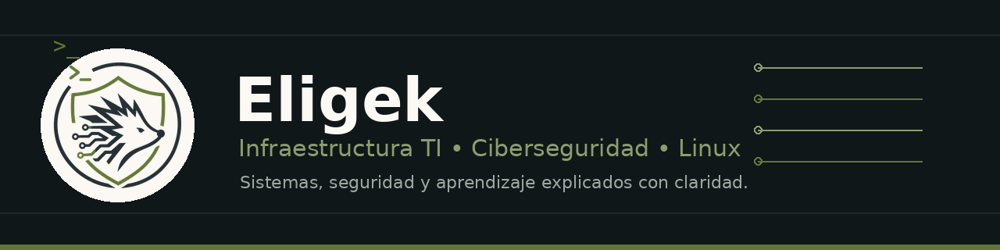

  

<h1 align="center">Hola, soy Eligek 🛡️</h1>

  <strong>Infraestructura TI • Ciberseguridad • Linux • Servidores • Monitorización</strong>

  Tecnología, Linux y ciberseguridad explicados con claridad.

  
  
  

---
🧠 Sobre mí
Estudiante de Ingeniería en Telemática enfocado en infraestructura TI, servidores y ciberseguridad operativa.
Me interesa construir entornos tecnológicos ordenados, seguros, documentados y resilientes, combinando administración de servidores, virtualización, monitoreo, automatización y buenas prácticas de seguridad.
Actualmente fortalezco mi perfil en administración de servidores Windows/Linux, virtualización, hardening, monitoreo, auditoría, documentación técnica y automatización.
---
🎯 Enfoque técnico
<table>
  <tr>
    <td align="center" width="33%">
      <strong>Infraestructura</strong> 
      Windows Server, Linux Server, VMware y entornos híbridos.
    </td>
    <td align="center" width="33%">
      <strong>Ciberseguridad</strong> 
      Hardening, monitoreo, auditoría y seguridad operativa.
    </td>
    <td align="center" width="33%">
      <strong>Documentación</strong> 
      Procedimientos, bitácoras, checklists y base de conocimiento.
    </td>
  </tr>
</table>
---
💻 Stack técnico
Sistemas, servidores e infraestructura

  
  
  
  
  

Seguridad, monitoreo y operaciones

  
  
  
  
  
  

Automatización, DevOps y herramientas

  
  
  
  
  
  
  

Bases de datos, web y documentación

  
  
  
  
  
  
  
  

---
📚 Actualmente aprendiendo
<table>
  <tr>
    <td><strong>Git & GitHub</strong></td>
    <td>Control de versiones, repositorios y documentación técnica.</td>
  </tr>
  <tr>
    <td><strong>Hardening</strong></td>
    <td>Líneas base de seguridad para servidores Windows/Linux.</td>
  </tr>
  <tr>
    <td><strong>Monitoreo</strong></td>
    <td>Visibilidad, alertamiento y observabilidad de infraestructura.</td>
  </tr>
  <tr>
    <td><strong>Automatización</strong></td>
    <td>PowerShell, Bash, Python y Ansible para administración TI.</td>
  </tr>
  <tr>
    <td><strong>Redes</strong></td>
    <td>Fundamentos orientados a CCNA e infraestructura real.</td>
  </tr>
</table>
---
🎥 Ruta de contenido
<table>
  <tr>
    <td><strong>Linux & Terminal</strong></td>
    <td>Comandos, shell, administración básica y buenas prácticas.</td>
  </tr>
  <tr>
    <td><strong>Ciberseguridad</strong></td>
    <td>Hardening, auditoría, monitoreo, seguridad operativa y laboratorios.</td>
  </tr>
  <tr>
    <td><strong>Servidores & Infraestructura</strong></td>
    <td>Windows Server, Linux Server, virtualización, servicios y documentación.</td>
  </tr>
  <tr>
    <td><strong>Crecimiento técnico</strong></td>
    <td>Ruta de aprendizaje, certificaciones, herramientas y experiencia real.</td>
  </tr>
</table>
---
📊 Actividad

  

---
🎧 Frase favorita

  <em>“Live a life you will remember.”</em> 
  <strong>Avicii</strong>

---
🚀 Meta profesional
Construir un perfil técnico enfocado en infraestructura TI segura, documentada y resiliente, combinando administración de servidores, ciberseguridad operativa, monitoreo, automatización y aprendizaje continuo.
---

  

