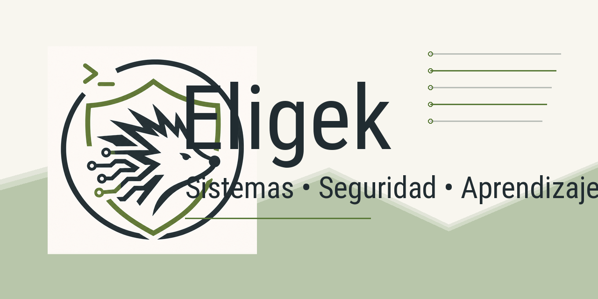
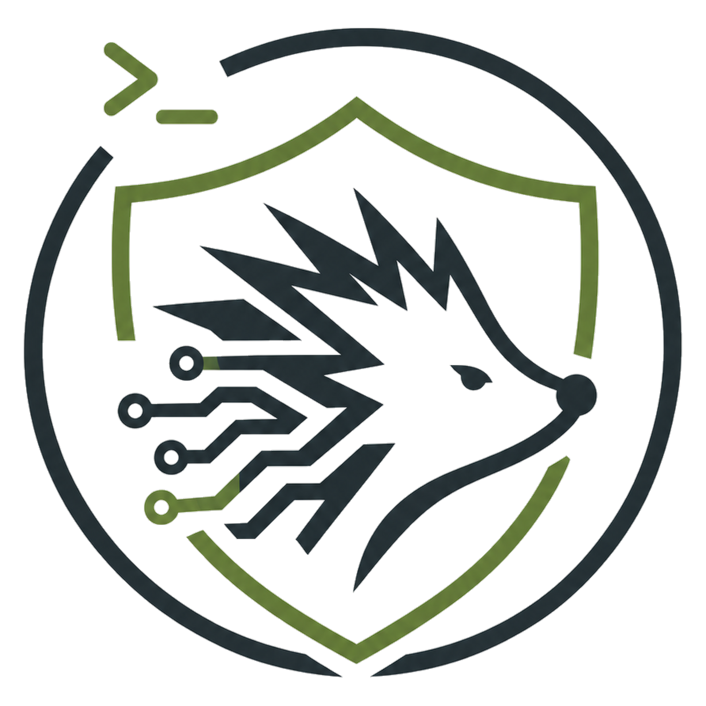
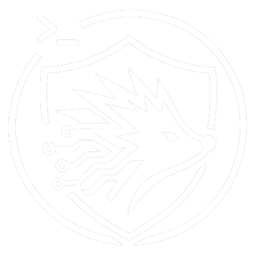

<p align="center">
  
</p>

<h1 align="center">Eligek</h1>

<h3 align="center">
  IT Infrastructure • Cybersecurity • Linux • Servers • Monitoring
</h3>

<p align="center">
  Building a technical profile focused on secure, documented and resilient infrastructure.
</p>

<p align="center">
  
  
  
  
</p>

<p align="center">
  <a href="https://www.linkedin.com/in/elias-blandon-202602n">
    
  </a>
  <a href="https://www.youtube.com/@eligek">
    
  </a>
  <a href="mailto:anthonyaltamira6@gmail.com">
    
  </a>
</p>

---

## About Me

Soy estudiante de **Ingeniería en Telemática** enfocado en infraestructura TI, servidores, Linux y ciberseguridad operativa.

Estoy construyendo un perfil técnico orientado a crear entornos tecnológicos **seguros, documentados, monitoreados y sostenibles**, combinando administración de servidores, virtualización, hardening, automatización, monitoreo y buenas prácticas de operación.

Mi objetivo es fortalecer habilidades reales en infraestructura y seguridad, documentar lo que aprendo y convertir cada laboratorio, configuración y proyecto técnico en experiencia demostrable.

```txt
Focus:
> Server Administration
> Linux & Windows Infrastructure
> Cybersecurity Operations
> Monitoring & Observability
> Technical Documentation
> Automation & Continuous Learning
```

---

## Core Areas

<table>
  <tr>
    <td align="center" width="25%">
      
      <br />
      <strong>Infrastructure</strong>
      <br />
      <sub>Windows Server, Linux Server, services, virtualization and operational continuity.</sub>
    </td>
    <td align="center" width="25%">
      
      <br />
      <strong>Cybersecurity</strong>
      <br />
      <sub>Hardening, secure configuration, audit practices and defensive operations.</sub>
    </td>
    <td align="center" width="25%">
      
      <br />
      <strong>Monitoring</strong>
      <br />
      <sub>Infrastructure visibility, alerts, dashboards and service health.</sub>
    </td>
    <td align="center" width="25%">
      
      <br />
      <strong>Documentation</strong>
      <br />
      <sub>Runbooks, procedures, diagrams, inventories and technical notes.</sub>
    </td>
  </tr>
</table>

---

## Tech Stack

### Systems & Infrastructure

<p>
  
  
  
  
  
</p>

### Security & Operations

<p>
  
  
  
  
  
</p>

### Monitoring & IT Operations

<p>
  
  
  
  
</p>

### Automation, Scripting & DevOps

<p>
  
  
  
  
  
  
  
</p>

### Databases, Web & Documentation

<p>
  
  
  
  
  
  
</p>

---

## Currently Learning

<table>
  <tr>
    <td width="30%"><strong>Networking</strong></td>
    <td>Strengthening fundamentals for routing, switching, segmentation and CCNA-oriented knowledge.</td>
  </tr>
  <tr>
    <td><strong>Server Security</strong></td>
    <td>Learning hardening practices, baseline configuration, access control and operational security.</td>
  </tr>
  <tr>
    <td><strong>Linux Administration</strong></td>
    <td>Improving command-line usage, services, permissions, logs, scripting and server workflows.</td>
  </tr>
  <tr>
    <td><strong>Monitoring & Visibility</strong></td>
    <td>Building better understanding of infrastructure health, alerting, dashboards and observability.</td>
  </tr>
  <tr>
    <td><strong>Automation</strong></td>
    <td>Developing practical skills with PowerShell, Bash, Python and infrastructure automation tools.</td>
  </tr>
</table>

---

## Featured Projects

<table>
  <tr>
    <th align="left">Project</th>
    <th align="left">Focus</th>
    <th align="left">Status</th>
  </tr>
  <tr>
    <td><strong>Infrastructure Documentation Lab</strong></td>
    <td>Technical notes, diagrams, checklists and operational procedures for IT environments.</td>
    <td><code>Building</code></td>
  </tr>
  <tr>
    <td><strong>Linux Server Practice</strong></td>
    <td>Server administration, shell usage, service configuration, permissions and troubleshooting.</td>
    <td><code>Learning</code></td>
  </tr>
  <tr>
    <td><strong>Security Hardening Notes</strong></td>
    <td>Secure configuration, baseline validation, audit practices and defensive documentation.</td>
    <td><code>In progress</code></td>
  </tr>
  <tr>
    <td><strong>Monitoring & Operations Path</strong></td>
    <td>Observability concepts, infrastructure monitoring, alerting logic and dashboard planning.</td>
    <td><code>Developing</code></td>
  </tr>
</table>

---

## GitHub Activity

<p align="center">
  
</p>

<p align="center">
  
</p>

<p align="center">
  
</p>

---

## Content Path

<table>
  <tr>
    <th align="left">Area</th>
    <th align="left">Direction</th>
  </tr>
  <tr>
    <td><strong>Linux & Terminal</strong></td>
    <td>Command line, shell usage, Linux administration, services and troubleshooting.</td>
  </tr>
  <tr>
    <td><strong>Cybersecurity</strong></td>
    <td>Hardening, secure configuration, monitoring, audit practices and practical labs.</td>
  </tr>
  <tr>
    <td><strong>Servers & Infrastructure</strong></td>
    <td>Windows Server, Linux Server, virtualization, documentation and operational services.</td>
  </tr>
  <tr>
    <td><strong>Monitoring & Operations</strong></td>
    <td>Dashboards, alerts, service health, availability and infrastructure visibility.</td>
  </tr>
  <tr>
    <td><strong>Technical Growth</strong></td>
    <td>Learning paths, certifications, labs, documentation habits and real-world technical practice.</td>
  </tr>
</table>

---

<p align="center">
  <em>“Live a life you will remember.”</em>
  <br />
  <strong>Avicii</strong>
</p>

---

<h3 align="center">Professional Direction</h3>

<p align="center">
  Focused on building a strong technical path in infrastructure, cybersecurity operations, monitoring, automation and technical documentation.
</p>

<p align="center">
  
</p>

<p align="center">
  
</p>
