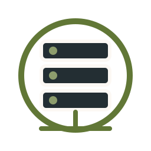
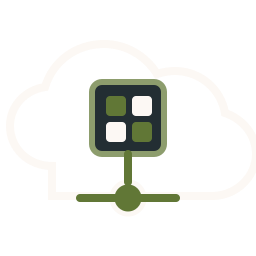
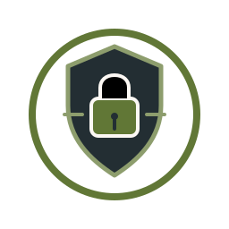
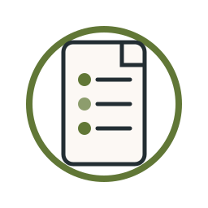
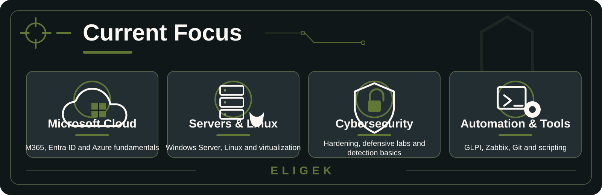
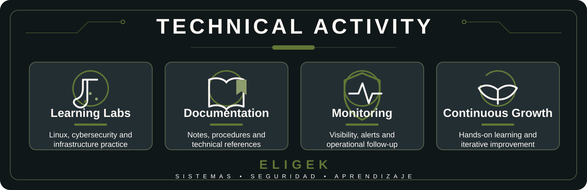

<p align="center">
  
</p>

<h1 align="center">Elias — Eligek</h1>

<h3 align="center">
  Junior Cybersecurity Learner • IT Infrastructure • Linux • Servers • Monitoring
</h3>

<p align="center">
  Aprendiendo, construyendo y documentando infraestructura TI segura, monitoreada y bien organizada.
</p>

<p align="center">
  
  
  
  
</p>

<p align="center">
  <a href="https://www.linkedin.com/in/elias-blandon-202602n">
    
  </a>
  <a href="https://www.youtube.com/@eligek">
    
  </a>
  <a href="mailto:anthonyaltamira6@gmail.com">
    
  </a>
</p>

---

## Sobre mi

Soy estudiante de **Ingenieria en Telematica** en etapa final, construyendo un perfil junior enfocado en **infraestructura TI, administracion de servidores, nube Microsoft, Linux, monitoreo y ciberseguridad defensiva**.

**Eligek** es mi marca personal tecnica: un espacio para aprender, documentar y compartir contenido educativo sobre sistemas, seguridad, laboratorios y crecimiento tecnico.

**Lo que hago**
- Diseno laboratorios y documentacion clara sobre servidores, nube y seguridad.
- Practico hardening, monitoreo y operacion defensiva con enfoque educativo.
- Comparto rutas de aprendizaje, notas tecnicas y runbooks.

**Ahora mismo**
- Windows Server, Linux, VMware, Proxmox, Microsoft 365, Entra ID, Azure, Cloudflare.
- Zabbix, GLPI, Grafana, inventario, tickets y documentacion operativa.
- Fundamentos de ciberseguridad, MITRE, ISO 27001 y buenas practicas.

---

## Core Areas

<table>
  <tr>
    <td align="center" width="25%">
      
      <br />
      <strong>Infrastructure</strong>
      <br />
      <sub>Windows Server, Linux, VMware, Proxmox, servicios y operación técnica.</sub>
    </td>
    <td align="center" width="25%">
      
      <br />
      <strong>Microsoft Cloud</strong>
      <br />
      <sub>Microsoft 365, Entra ID, Exchange, Teams, SharePoint y fundamentos de Azure.</sub>
    </td>
    <td align="center" width="25%">
      
      <br />
      <strong>Cybersecurity</strong>
      <br />
      <sub>Hardening, análisis defensivo, seguridad básica, MITRE, ISO 27001 y labs.</sub>
    </td>
    <td align="center" width="25%">
      
      <br />
      <strong>Monitoring & Docs</strong>
      <br />
      <sub>Zabbix, GLPI, Grafana, inventario, tickets y documentación operativa.</sub>
    </td>
  </tr>
</table>

---

## Current Focus

<p align="center">
  
</p>

---

## Tech Stack

<details>
  <summary><strong>Sistemas, servidores e infraestructura</strong></summary>
  <p>
    
    
    
    
    
    
    
  </p>
</details>

<details>
  <summary><strong>Microsoft Cloud y administracion</strong></summary>
  <p>
    
    
    
    
    
    
    
  </p>
</details>

<details>
  <summary><strong>Ciberseguridad y operacion defensiva</strong></summary>
  <p>
    
    
    
    
    
    
    
    
    
  </p>
</details>

<details>
  <summary><strong>Monitoreo, ITSM y documentacion</strong></summary>
  <p>
    
    
    
    
    
    
    
  </p>
</details>

<details>
  <summary><strong>Automatizacion, scripting y DevOps learning</strong></summary>
  <p>
    
    
    
    
    
    
    
  </p>
</details>

<details>
  <summary><strong>Bases de datos, web y servicios</strong></summary>
  <p>
    
    
    
    
    
    
    
  </p>
</details>

---

## En aprendizaje

<details>
  <summary><strong>Rutas y temas actuales</strong></summary>
  <table>
    <tr>
      <td width="30%"><strong>Cybersecurity Fundamentals</strong></td>
      <td>Estudiando fundamentos de ciberseguridad mediante cursos introductorios, laboratorios y documentacion tecnica.</td>
    </tr>
    <tr>
      <td><strong>Kaspersky Learning Path</strong></td>
      <td>Avanzando en cursos de nivel basico y fundamentos para reforzar conceptos defensivos y buenas practicas.</td>
    </tr>
    <tr>
      <td><strong>Microsoft Cloud & Security</strong></td>
      <td>Construyendo una ruta hacia Azure, Entra ID, AZ-900 y SC-900.</td>
    </tr>
    <tr>
      <td><strong>Networking Foundations</strong></td>
      <td>Fortaleciendo bases para CCNA: routing, switching, segmentacion, VPN y conceptos de red.</td>
    </tr>
    <tr>
      <td><strong>Monitoring & IT Operations</strong></td>
      <td>Mejorando habilidades en Zabbix, GLPI, Grafana, inventario, tickets y documentacion operativa.</td>
    </tr>
    <tr>
      <td><strong>Linux & Azure Administration</strong></td>
      <td>Profundizando en administracion de Linux, servicios, permisos, logs, Azure y Entra ID.</td>
    </tr>
  </table>
</details>

---

## Cybersecurity Learning Path

```txt
Current focus:
01. Fundamentos de ciberseguridad
02. Seguridad en servidores Windows/Linux
03. Hardening y configuración segura
04. Monitoreo, logs y detección básica
05. Pentesting educativo en laboratorios controlados
06. Análisis defensivo de comportamiento malicioso
07. Documentación de hallazgos y procedimientos
```

> Todo laboratorio de seguridad debe realizarse en entornos propios, controlados y con fines educativos.

---

## Featured Projects

<table>
  <tr>
    <th align="left">Project</th>
    <th align="left">Focus</th>
    <th align="left">Status</th>
  </tr>
  <tr>
    <td><strong>Linux Server Hardening Lab</strong></td>
    <td>Laboratorio de seguridad para reforzar configuración, permisos, servicios, logs y buenas prácticas en Linux.</td>
    <td><code>Learning Lab</code></td>
  </tr>
  <tr>
    <td><strong>Windows Server Administration Notes</strong></td>
    <td>Notas técnicas sobre administración, servicios, seguridad básica y documentación de entornos Windows Server.</td>
    <td><code>Building</code></td>
  </tr>
  <tr>
    <td><strong>Monitoring Stack Lab</strong></td>
    <td>Prácticas con monitoreo, dashboards, alertas, inventario y seguimiento operativo usando herramientas open source.</td>
    <td><code>In progress</code></td>
  </tr>
  <tr>
    <td><strong>Cybersecurity Fundamentals Notes</strong></td>
    <td>Repositorio educativo con conceptos base, amenazas, controles, frameworks, laboratorios y apuntes de estudio.</td>
    <td><code>Learning</code></td>
  </tr>
  <tr>
    <td><strong>Malware Behavior Awareness Lab</strong></td>
    <td>Laboratorio controlado para comprender comportamiento malicioso, indicadores, prevención y análisis defensivo básico.</td>
    <td><code>Planned</code></td>
  </tr>
  <tr>
    <td><strong>Azure & Entra ID Fundamentals Lab</strong></td>
    <td>Prácticas de identidad, usuarios, grupos, acceso, seguridad básica y administración inicial en nube Microsoft.</td>
    <td><code>Roadmap</code></td>
  </tr>
</table>

---

## Technical Activity

<p align="center">
  
</p>

---

## Content Path

<table>
  <tr>
    <th align="left">Area</th>
    <th align="left">Content Direction</th>
  </tr>
  <tr>
    <td><strong>Ciberseguridad básica</strong></td>
    <td>Conceptos fundamentales, amenazas comunes, buenas prácticas, seguridad defensiva y explicación clara para principiantes.</td>
  </tr>
  <tr>
    <td><strong>Pentesting educativo</strong></td>
    <td>Laboratorios controlados, metodología, reconocimiento, análisis de vulnerabilidades y aprendizaje responsable.</td>
  </tr>
  <tr>
    <td><strong>Linux & Terminal</strong></td>
    <td>Comandos, administración básica, servicios, permisos, logs, troubleshooting y hábitos de terminal.</td>
  </tr>
  <tr>
    <td><strong>Servers & Cloud</strong></td>
    <td>Windows Server, Linux Server, Microsoft 365, Azure, Entra ID y servicios de infraestructura.</td>
  </tr>
  <tr>
    <td><strong>Monitoring & Operations</strong></td>
    <td>GLPI, Zabbix, Grafana, inventario, tickets, alertas, dashboards y documentación operativa.</td>
  </tr>
  <tr>
    <td><strong>Automation & Documentation</strong></td>
    <td>Scripts, procedimientos, checklists, notas técnicas, repositorios de aprendizaje y mejora continua.</td>
  </tr>
</table>

<p align="center">
  <a href="https://www.youtube.com/@eligek">
    
  </a>
</p>

---

<p align="center">
  <em>“Live a life you will remember.”</em>
  <br />
  <strong>Avicii</strong>
</p>

---

<h3 align="center">Sistemas • Seguridad • Aprendizaje</h3>

<p align="center">
  Focused on learning, documenting and sharing practical knowledge about infrastructure, cybersecurity, Linux, monitoring and technical growth.
</p>

<p align="center">
  
</p>

<p align="center">
  
</p>
